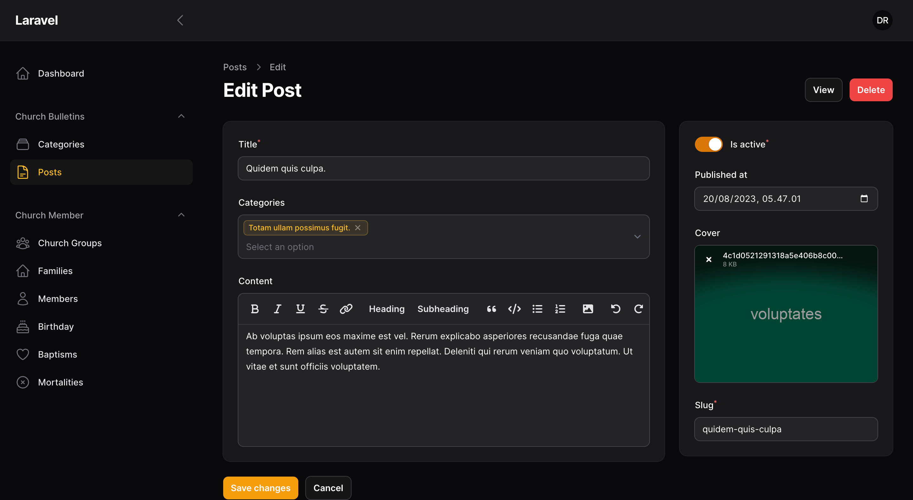
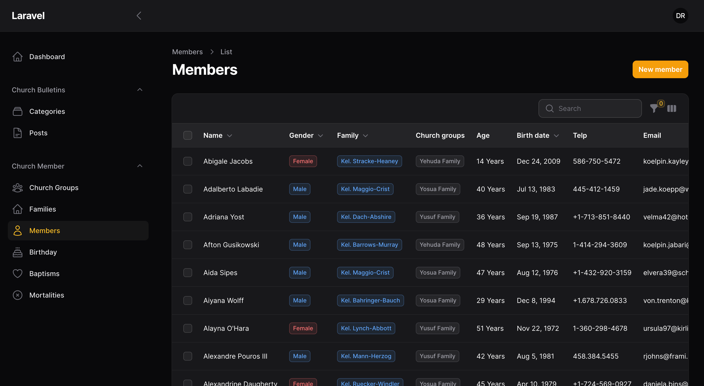
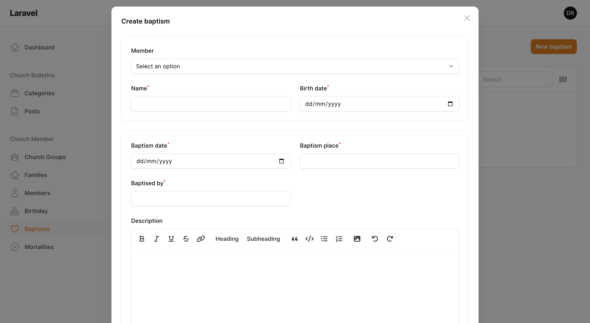

## Introduction

This project provides a foundation for building modern web applications using the TALL stack and Filament for a beautiful and functional admin panel within Laravel.

## What's Included?

This repository contains the essential components for a TALL stack setup with Filament integration:

-   Tailwind CSS: Utility-first CSS framework for rapid and responsive UI development.
-   Alpine.js: Lightweight JavaScript framework for adding interactivity without extensive coding.
-   Laravel Livewire: Server-side rendering framework for dynamic UIs and reduced page load times.
-   Laravel: Core framework for building full-fledged web applications.
-   Filament: Elegant admin panel package for Laravel that leverages the TALL stack.

## Benefits

-   Faster Development: Streamlined development flow with readily available components and reduced need for complex JavaScript.
-   Improved Maintainability: Clear separation of concerns and structure promote code clarity and maintainability.
-   Enhanced User Experience: Livewire ensures real-time updates and Filament offers a user-friendly admin interface.
-   Reduced Page Load Times: Livewire leverages server-side rendering, minimizing initial page loads.

## Getting Started

1. Prerequisites: Ensure you have Laravel and Composer installed on your development machine.
   Installation:
2. Clone this repository.
    - Run `composer install` to install dependencies.
    - Run `npm install` && `npm run dev` (if using Node.js for Tailwind CSS) or follow Tailwind CSS setup instructions for your preferred method.
    - Run `php artisan migrate` to setup the database
    - Run `php artisan filament:make-user` to create your initial admin user.

## Additional Resources

-   Tailwind CSS: https://tailwindcss.com/docs/installation
-   Alpine.js: https://alpinejs.dev/
-   Laravel Livewire: https://livewire.laravel.com/docs/installation
-   Filament Documentation: https://filamentphp.com/docs

# Snapshot

